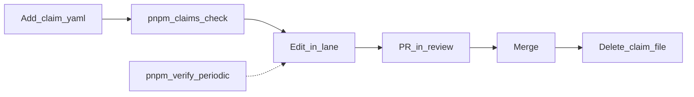

# Human-side checklist: keep everything aligned

Use this as your **orchestrator** pass when you want merge safety for agents, green CI, and clear continuity for the next person or agent. Lane rules, hotspots, and claim lifecycle are defined in [agents.md](./agents.md) and [claims/README.md](./claims/README.md); this page is the **action checklist** for humans.

## 1. Know your lane (before anyone edits)

- **Lane A** — web/UI: `apps/web`, `packages/ui`, `packages/i18n`, `packages/tokens`, `packages/catalog`.
- **Lane B** — API/data: `apps/api`, `apps/party`, `packages/api-router`, `packages/db`, `packages/auth`, `packages/validators`, `packages/geo`.
- **Lane O (human orchestrator)** — root configs, CI, [`.env.example`](../.env.example), `README.md`, **lockfile** (`package.json`, `pnpm-lock.yaml`, `turbo.json`). Treat **H6-deps** as serial: no parallel lockfile PRs.

**You should:** assign each task to a single lane; if work spans lanes, **split PRs or sequence** so hotspot rules in [agents.md](./agents.md) are not violated.

## 2. Claims: mandatory for non-trivial edits

1. **Before** substantive edits, add `docs/claims/EUSHOP-<lane>-<nnn>.yaml` (copy from [`docs/claims/_template.yaml`](./claims/_template.yaml)); **`id` must match the filename**.
2. List **every path** you expect under `touches` (prefer literal paths; set `hotspot_sub_lane` when you touch H1–H6).
3. Run **`pnpm claims:check`** locally; resolve overlaps or wait for the conflicting claim to merge.
4. Open PR → set claim `status: in_review`.
5. After merge → **delete the claim file** on `main` (do not leave long-lived `done` files).

**Hotspots (globally one active claim each):** H1-router, H2-context, H3-schema, H4-i18n, H5-shell, H6-deps — see the table in [agents.md](./agents.md).

## 3. Verification cadence (CI alignment)

After **2–3** tasks per lane, run **`pnpm verify`** once (format, typecheck, lint, unit tests, **claims:check**, build — aligns with CI), then continue.

**Habits:**

- Before pushing a meaningful PR: at least **`pnpm claims:check`**.
- Before a batch merge or end of day: **`pnpm verify`**.

## 4. Parallel agents (only when safe)

Run **up to 10** background agents **only** when `pnpm claims:check` passes: no overlapping `touches`, and **at most one active claim per hotspot sub-lane**. Require every agent/session to have a valid claim before edits.

Backlog: [cursor-parallel-backlog.md](./cursor-parallel-backlog.md).

## 5. Env and secrets (local ↔ deployed alignment)

- Keep repo **[`.env.example`](../.env.example)** in sync when you add required root-level vars (typically **lane O**). Package-specific examples (e.g. [`packages/db/.env.example`](../packages/db/.env.example)) should stay consistent when DB or service wiring changes.
- Document new service URLs, feature flags, or DB expectations where the team already keeps runbooks — avoid one-off “only on my machine” setups.

## 6. Handoffs (human + next agent)

After a substantive session, append or open `docs/handoffs/YYYY-MM-DD.md` using the template in [agents.md](./agents.md) (see also `docs/manifesto.md` §9): objective, status buckets, touched paths, checks run, blockers, assumptions, risk ledger, next step. **Separate facts from assumptions.**

## 7. PR hygiene (merge alignment)

- One concern per PR where hotspots are involved (especially H3-schema, H4-i18n namespace, H5-shell).
- Router registration: **append-only** style for **H1-router** as in [agents.md](./agents.md).
- Remove the claim file in the same merge train as the completed work when possible.

## Quick daily routine (minimal)

1. Pull latest `main`.
2. For each active task: claim file present, `pnpm claims:check` green.
3. After a few tasks: `pnpm verify`.
4. On merge: delete claim file; update handoff if context is non-obvious.

If something still feels wrong, check first: **overlapping `touches`, missing claim, or hotspot double-booking** — fix that before scaling parallel agents.

