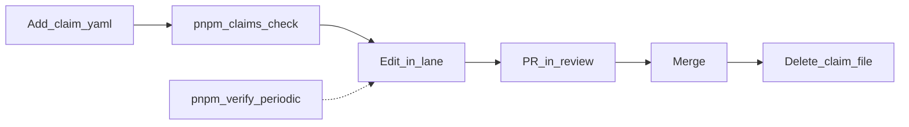

# Human-side checklist: keep everything aligned

Use this as your **orchestrator** pass when you want merge safety for agents, green CI, and clear continuity for the next person or agent. Lane rules, hotspots, and claim lifecycle are defined in [agents.md](./agents.md) and [claims/README.md](./claims/README.md); this page is the **action checklist** for humans.

## 1. Know your lane (before anyone edits)

- **Lane A** — web/UI: `apps/web`, `packages/ui`, `packages/i18n`, `packages/tokens`, `packages/catalog`.
- **Lane B** — API/data: `apps/api`, `apps/party`, `packages/api-router`, `packages/db`, `packages/auth`, `packages/validators`, `packages/geo`.
- **Lane O (human orchestrator)** — root configs, CI, [`.env.example`](../.env.example), `README.md`, **lockfile** (`package.json`, `pnpm-lock.yaml`, `turbo.json`). Treat **H6-deps** as serial: no parallel lockfile PRs.

**You should:** assign each task to a single lane; if work spans lanes, **split PRs or sequence** so hotspot rules in [agents.md](./agents.md) are not violated.

## 2. Claims: mandatory for non-trivial edits

1. **Before** substantive edits, add `docs/claims/EUSHOP-<lane>-<nnn>.yaml` (copy from [`docs/claims/_template.yaml`](./claims/_template.yaml)); **`id` must match the filename**.
2. List **every path** you expect under `touches` (prefer literal paths; set `hotspot_sub_lane` when you touch H1–H6).
3. Run **`pnpm claims:check`** locally; resolve overlaps or wait for the conflicting claim to merge.
4. Open PR → set claim `status: in_review`.
5. After merge → **delete the claim file** on `main` (do not leave long-lived `done` files).

**Hotspots (globally one active claim each):** H1-router, H2-context, H3-schema, H4-i18n, H5-shell, H6-deps — see the table in [agents.md](./agents.md).

## 3. Verification cadence (CI alignment)

After **2–3** tasks per lane, run **`pnpm verify`** once (format, typecheck, lint, unit tests, **claims:check**, build — aligns with CI), then continue.

**Habits:**

- Before pushing a meaningful PR: at least **`pnpm claims:check`**.
- Before a batch merge or end of day: **`pnpm verify`**.

## 4. Parallel agents (only when safe)

Run **up to 10** background agents **only** when `pnpm claims:check` passes: no overlapping `touches`, and **at most one active claim per hotspot sub-lane**. Require every agent/session to have a valid claim before edits.

Backlog: [cursor-parallel-backlog.md](./cursor-parallel-backlog.md).

## 5. Env and secrets (local ↔ deployed alignment)

- Keep repo **[`.env.example`](../.env.example)** in sync when you add required root-level vars (typically **lane O**). Package-specific examples (e.g. [`packages/db/.env.example`](../packages/db/.env.example)) should stay consistent when DB or service wiring changes.
- Document new service URLs, feature flags, or DB expectations where the team already keeps runbooks — avoid one-off “only on my machine” setups.

## 6. Handoffs (human + next agent)

After a substantive session, append or open `docs/handoffs/YYYY-MM-DD.md` using the template in [agents.md](./agents.md) (see also `docs/manifesto.md` §9): objective, status buckets, touched paths, checks run, blockers, assumptions, risk ledger, next step. **Separate facts from assumptions.**

## 7. PR hygiene (merge alignment)

- One concern per PR where hotspots are involved (especially H3-schema, H4-i18n namespace, H5-shell).
- Router registration: **append-only** style for **H1-router** as in [agents.md](./agents.md).
- Remove the claim file in the same merge train as the completed work when possible.

## Quick daily routine (minimal)

1. Pull latest `main`.
2. For each active task: claim file present, `pnpm claims:check` green.
3. After a few tasks: `pnpm verify`.
4. On merge: delete claim file; update handoff if context is non-obvious.

If something still feels wrong, check first: **overlapping `touches`, missing claim, or hotspot double-booking** — fix that before scaling parallel agents.

## 8. One-shot verification (copy-paste)

From repo root (PowerShell-friendly):

```bash
pnpm claims:check && pnpm i18n:check && pnpm verify
```

**What this runs:** claim overlap + hotspot rules, locale JSON leaf parity vs `en.json`, then format check, monorepo typecheck + lint, unit tests, claims again, and production builds (matches the spirit of CI in `pnpm verify`).

## 9. “And more” (high leverage, low ceremony)

- **Mobile parity:** when web ships a shared consumer flow (e.g. catalog picker), mirror or explicitly document gaps in `apps/mobile` — see [cursor-parallel-backlog.md](./cursor-parallel-backlog.md) **A-007**.
- **Ship log:** user-visible releases belong in `CHANGELOG.md` **and** `changelog.entries` in `packages/i18n/src/messages/en.json` (then `node scripts/sync-i18n-missing-from-en.mjs` for deep keys; **arrays** like `changelog.entries` must be updated in every locale or only in `en` if your process copies the array—see `scripts/check-i18n-keys.mjs` behaviour).
- **Backlog hygiene:** after a task lands, tick or add a line in [cursor-parallel-backlog.md](./cursor-parallel-backlog.md) so the parallel queue stays honest.

## 10. Product pictures assurance plan (quality + completeness)

Use this mini-plan whenever product-picker/gallery code or catalog image sourcing changes.

### A. Acceptance criteria (must all be true)

- **Coverage:** every product tile in Pics renders a visual (real image or styled fallback card).
- **Reachability:** Pics can load all catalog pages (not just first page).
- **Selection:** tapping any tile always attaches a picture URL to the selection payload.
- **Consistency:** web and mobile pickers expose the same Pics concept and behavior.
- **Safety:** external URLs are re-hosted through `media.fetchRemoteImage` (no raw hotlinking in final listing payloads).

### B. Verification cadence

- **On every PR touching picker/gallery/catalog image flow:**
  - `pnpm claims:check`
  - `pnpm i18n:check`
  - `pnpm --filter @eushop/web typecheck`
  - `pnpm --filter @eushop/web lint`
  - `pnpm --filter @eushop/mobile typecheck`
- **Before merge train / end of day:** `pnpm verify`

### C. Manual QA script (5 minutes)

1. Open web picker → click **Pics** → scroll deep enough to trigger additional page fetches.
2. Confirm mixed rows: items with real photos and items with fallback cards both render cleanly.
3. Pick a real-photo item and a fallback-card item; each should appear in selected photos strip.
4. Open propose modal → confirm attached photos strip shows chosen images.
5. Repeat core flow on mobile picker (open Pics, pick item, verify selected photo appears).

### D. Release gate (do not skip)

- If any criterion in **A** fails, do not merge; fix first.
- Append handoff facts in `docs/handoffs/YYYY-MM-DD.md` with checks run and pass/fail.
- Keep claim file in `in_review` until all checks and manual QA pass; delete claim on `main` after merge.

### E. Ownership and SLA (avoid drift)

- **Owner lane:** Lane **A** owns picker/gallery UX parity and fallback-card visuals.
- **API dependency owner:** Lane **B** owns `catalog.browse` / `searchWithSuggestions` stability and pagination correctness.
- **Response SLA:** picture regressions on core flows (listing/request/trip) should be triaged same day and patched within next working day.

### F. Image quality policy (what “nice” means)

- Prefer canonical catalog photos where available (`imageVariants.large` then `small`, then `defaultImageUrl`).
- When missing, use generated fallback cards with:
  - readable product name,
  - country flag signal,
  - neutral branded background (no noisy colors),
  - deterministic rendering (same item → same visual style each time).
- Reject source images that are clearly broken (404, tiny, unreadable) during moderation/import workflows; keep fallback visible until fixed.

### G. Monitoring hooks (minimum)

- Track and review weekly:
  - `% tiles using fallback` (coverage debt),
  - `% failed remote image fetches`,
  - `% picker selections with an attached picture` (should be ~100%).
- Record quick numbers in handoff notes or ops log when making picture-flow changes.

### H. Follow-up backlog when quality debt appears

- If fallback ratio is high for a category/country, open targeted tasks in [cursor-parallel-backlog.md](./cursor-parallel-backlog.md):
  - Lane **B**: importer/moderation/source improvements,
  - Lane **A**: gallery UX, sorting/filtering, and fallback visual refinements.
- Keep tasks small and lane-pure; use claims before editing.

### I. Risk matrix (quick triage)

- **P0 (ship blocker):**
  - Pics cannot open,
  - selection produces no picture URL,
  - gallery crashes on scroll/pagination.
- **P1 (fix before broad rollout):**
  - fallback cards unreadable,
  - large subset of products missing any visual,
  - mobile/web behavior mismatch.
- **P2 (batch in next slice):**
  - minor style drift,
  - slow image loading without failures,
  - copy polish.

### J. Rollback + containment

- If picture flow regresses in production:
  1. Revert latest picker/gallery PR (or hotfix branch) to last known green commit.
  2. Keep upload/paste flow available so users can continue posting with images.
  3. Log incident summary in handoff with root cause hypothesis + follow-up owner.
- If API pagination causes issues, temporarily cap Pics to first page again while preserving fallback visuals, then patch paging safely.

### K. Edge-case QA table (run when touching image flow)

- **Empty catalog:** Pics opens and shows empty-state text, no crash.
- **All-fallback catalog:** all tiles still render, selection still attaches image data URL.
- **Mixed catalog:** real and fallback visuals both selectable.
- **Long product names:** text remains readable/truncated in cards.
- **Slow network:** loading skeleton/spinner appears; UI remains interactive.
- **Modal controls:** backdrop/Escape/Close button all dismiss correctly.
- **Accessibility smoke test:** keyboard focus can reach open/close controls on web.

### L. Definition of done (pictures)

- Acceptance criteria **A** all pass.
- Verification cadence **B** executed and green.
- Manual QA script **C** completed on web + mobile.
- Changelog + backlog + handoff updated for user-visible changes.
- Claim file lifecycle completed (`in_review` before merge, deleted on `main` after merge).

### M. KPI thresholds (target values)

- **Picture attach success:** `>= 99%` of product selections end with at least one picture URL.
- **Fallback usage:** `< 35%` of visible tiles over a rolling week (higher means catalog photo debt).
- **Gallery reliability:** `< 1%` failed gallery loads (open + first render).
- **Remote fetch failures:** `< 3%` failed `media.fetchRemoteImage` calls.
- **Parity drift:** `0` known blocking mismatches between web and mobile Pics behavior.

### N. Weekly routine (owner runbook)

- **Monday:** review fallback ratio by top categories/countries; create B-lane importer/moderation tasks where needed.
- **Midweek:** run the manual QA script once on staging web + mobile for the newest picker changes.
- **Friday:** record KPI snapshot in handoff/ops notes and close resolved picture debt tasks.

### O. Monthly maintenance (catalog health)

- Validate that new catalog additions have either:
  - a canonical image variant, or
  - an approved fallback card path (temporary).
- Spot-check 20 random products from mixed categories and confirm visual quality/readability.
- Re-prioritize backlog picture tasks based on observed fallback hotspots and user reports.

### P. PR checklist (copy into description)

```md
## Product pictures checklist

- [ ] Acceptance criteria A pass
- [ ] Required checks in B are green
- [ ] Manual QA C completed (web + mobile)
- [ ] Risk level classified (I)
- [ ] Rollback path confirmed (J)
- [ ] Backlog/changelog/handoff updated
```

### Q. Incident mini-template (copy-paste)

```yaml
PICTURE_INCIDENT_TITLE: ''
SEVERITY: 'P0|P1|P2'
IMPACT_SURFACE: ['web-picker', 'mobile-picker', 'gallery', 'selection', 'upload/paste']
USER_IMPACT: ''
START_TIME_UTC: ''
DETECTION: ''
CONTAINMENT_ACTION: ''
ROOT_CAUSE_HYPOTHESIS: ''
FIX_OWNER: ''
ETA: ''
FOLLOW_UP_TASK_IDS: []
POSTMORTEM_LINK: ''
```

### R. “No surprises” merge rule

- Do not merge picture-flow PRs late in the day unless:
  - all checks are green,
  - manual QA script is done,
  - and rollback owner is identified.
- If unsure, defer merge and leave a clear handoff entry.

### S. Automation hooks (implemented)

- `scripts/pictures-smoke-check.mjs` now validates:
  - Pics-related `productPicker.*` i18n keys in `en.json`,
  - fallback image logic remains in web/mobile pickers,
  - gallery pagination logic remains enabled,
  - catalog router still exposes paginated `browse` (`nextCursor`).
- Root script alias is available:
  - `pnpm pictures:check`
- CI integration is active in `.github/workflows/ci.yml`:
  - runs always on `push`,
  - runs on PRs only when picture-flow paths change (paths filter).

### T. Data-quality improvement loop

- Keep a simple “top missing-image products” list weekly (top selected with fallback visuals).
- Route this list to moderation/import cleanup:
  - add canonical images to high-demand products first.
- After each cleanup batch, re-check KPI **Fallback usage** and update backlog priorities.

### U. Communication template (Slack/PR comment)

```md
Picture-flow update complete.

- Coverage: [pass/fail]
- Reachability (all pages): [pass/fail]
- Selection attaches picture URL: [pass/fail]
- Web/mobile parity: [pass/fail]
- Checks run: claims, i18n, web typecheck/lint, mobile typecheck, verify
- Remaining debt: [short list or none]
```

### V. Analytics consent evidence (A-028)

Use this proof block in PRs touching consent, analytics bootstrap, or PostHog wiring.

```md
## Analytics consent evidence

- [ ] Test env has `NEXT_PUBLIC_POSTHOG_KEY` set
- [ ] Fresh private window (no prior `localStorage` consent)
- [ ] Before consent: Network tab shows **0** calls to `posthog.com` / configured host
- [ ] After clicking "Accept analytics": PostHog network calls begin
- [ ] After reload with stored consent: PostHog initializes once (no duplicate bootstrap)
- [ ] Screenshot or HAR attached for before/after
```

Minimum commands/checks:

- `pnpm --filter @eushop/web typecheck`
- `pnpm --filter @eushop/web lint`
- optional full gate: `pnpm verify`


