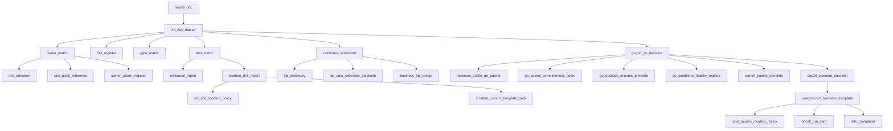

# Readiness Dependency Graph

## Dependency usage notes

- Update upstream docs first (`30-day-master`, `owner-matrix`, `risk-register`) before updating dependent decision artifacts.
- Decision artifacts should only be finalized after test/rehearsal/drill evidence is done.
- Post-launch transition docs depend on final go/no-go outcomes and closeout status.
