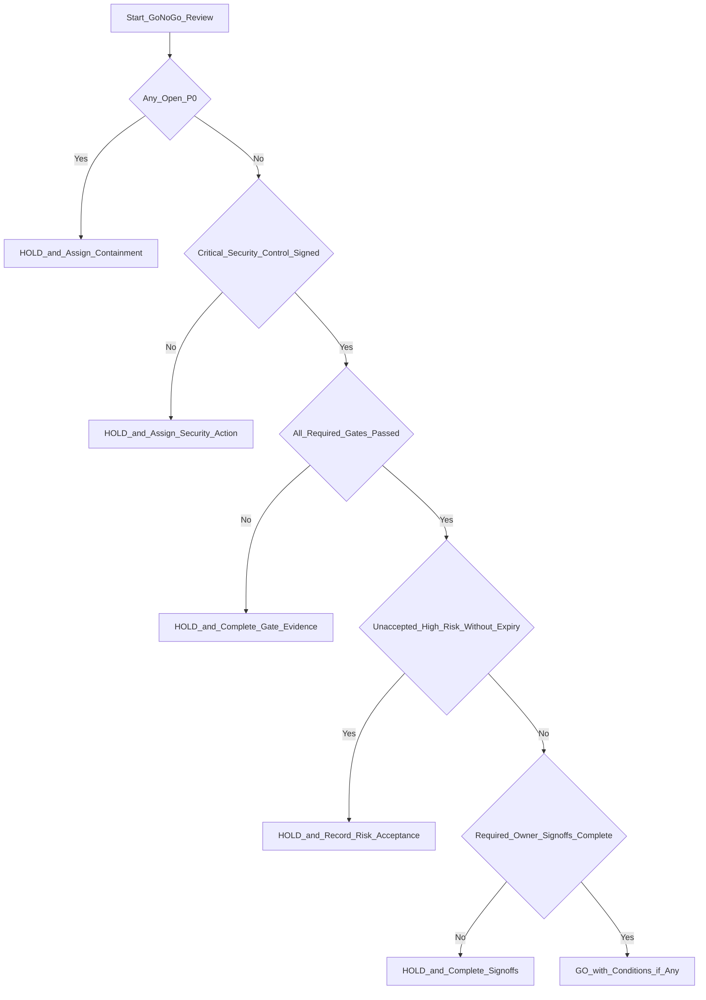

# Go/No-Go Decision Tree

## Decision policy

- Any `HOLD` branch must produce:
  - owner,
  - due date,
  - next review checkpoint.
- `GO` requires documented rollback owner and validated rollback path.
