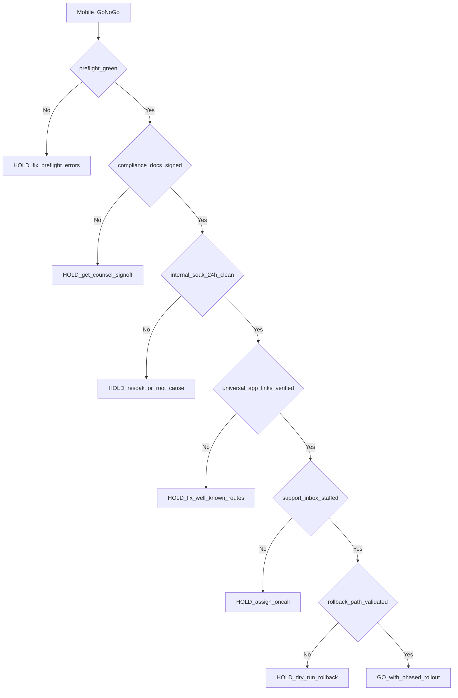

# Mobile go/no-go decision

Single-page worksheet for the meeting that authorises (or vetoes) a mobile production submission. Modeled on [`go-no-go-decision-tree.md`](go-no-go-decision-tree.md) but mobile-specific.

The decision is recorded in [`go-no-go-decision.md`](go-no-go-decision.md) along with the named owner and rollback path.

## Pre-meeting prep (Mobile lead)

- [ ] [`pnpm --filter @eushop/mobile preflight`](../../apps/mobile/scripts/preflight.mjs) green on the release branch (paste the summary line).
- [ ] CI workflow [`mobile-preflight.yml`](../../.github/workflows/mobile-preflight.yml) green on the release branch.
- [ ] Internal track soak ≥ 24 h with crash-free session rate ≥ 99.5 % on Sentry mobile.
- [ ] [`mobile-data-safety.md`](../ops/mobile-data-safety.md) and [`mobile-privacy-nutrition.md`](../ops/mobile-privacy-nutrition.md) reviewed by counsel — initials in [`decision-audit-trail-index.md`](decision-audit-trail-index.md).
- [ ] [`mobile-app-review.md`](../ops/mobile-app-review.md) demo creds verified by a teammate who is not the Mobile lead.
- [ ] AASA + assetlinks.json fingerprints visible at `https://eushop.eu/.well-known/...` (curl them in the meeting).
- [ ] Production hosts (`api.eushop.eu`, `eushop.eu`, `party.eushop.eu`) green for ≥ 7 days.

## Decision tree

## Decision criteria (must all be GREEN)

| #   | Criterion                                                                                         | Source                                                                                                               | Status |
| --- | ------------------------------------------------------------------------------------------------- | -------------------------------------------------------------------------------------------------------------------- | ------ |
| 1   | Preflight gate green                                                                              | [`pnpm preflight`](../../apps/mobile/scripts/preflight.mjs)                                                          |        |
| 2   | All four compliance docs reviewed by counsel                                                      | [`decision-audit-trail-index.md`](decision-audit-trail-index.md)                                                     |        |
| 3   | Internal track ≥ 24 h soak, crash-free ≥ 99.5 %                                                   | Sentry mobile dashboard                                                                                              |        |
| 4   | Universal Link round-trip works on a clean iOS device                                             | Manual test (paste seeded URL in Notes → opens app)                                                                  |        |
| 5   | App Link round-trip works on a clean Android device                                               | Manual test (paste seeded URL in Gmail → opens app)                                                                  |        |
| 6   | AASA + assetlinks.json return populated manifests                                                 | `curl https://eushop.eu/.well-known/apple-app-site-association` and `assetlinks.json`                                |        |
| 7   | Magic-link end-to-end on both platforms                                                           | Manual test                                                                                                          |        |
| 8   | Push roundtrip works on both platforms                                                            | Send test message via tRPC; both devices ping in < 10 s                                                              |        |
| 9   | Production env vars all set (see [`mobile-store-release.md` table](../ops/mobile-store-release.md#common-environment-variables-consolidated)) | EAS secret list + web env audit                                                                                      |        |
| 10  | Support inbox staffed for 24 h post-launch                                                        | Ops lead confirmation                                                                                                |        |
| 11  | Rollback dry-run completed in the last 30 days                                                    | OTA `eas update` to a no-op message + immediate revert; document in [`evidence-log.md`](evidence-log.md)             |        |
| 12  | Marketing surfaces (Smart App Banner, store badges) appear on staging                             | Visit `https://staging.eushop.eu` on Mobile Safari                                                                   |        |

## Sign-offs

- Mobile lead: ____________________  Date: __________
- Ops lead: _______________________  Date: __________
- Security lead: __________________  Date: __________
- Product lead: ___________________  Date: __________
- Founder: ________________________  Date: __________

## Rollback owner + path (must be filled before GO)

- Rollback owner: ____________________
- Rollback channel: OTA via `eas update --branch production` (JS-only) / Halt Play rollout + expedited App Store review (native)
- Rollback dry-run last verified: __________
