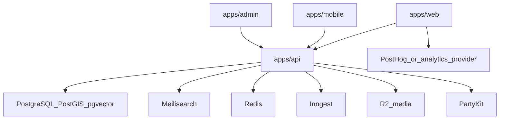

# System Dependency Map And Failure Domains

## Service topology

## Core dependencies by surface

| Surface | Runtime dependencies | Failure blast radius | Primary owner |
| --- | --- | --- | --- |
| Web (`apps/web`) | API URL, auth URL, i18n bundles, analytics key | Discovery, listing, reservation UX degraded | Lane A |
| Mobile (`apps/mobile`) | API URL, auth flows, media URL | Journey completion and chat degraded | Lane A |
| API (`apps/api`) | DB, Redis, search, auth secret, jobs key | Core product unavailable | Lane B |
| Admin (`apps/admin`) | API, auth, moderation routes | Moderation and ops tooling degraded | Lane A/B |
| Party worker (`apps/party`) | Durable objects, auth linkage | Messaging delayed or unavailable | Lane B |

## Failure domains and controls

| Domain | Typical failure | Preventive control | Recovery control |
| --- | --- | --- | --- |
| Authentication | Secret mismatch or callback URL drift | Env parity review per week | Roll back env change, revalidate login smoke |
| Data persistence | DB migration or schema mismatch | Controlled migrations and preflight checks | Restore from backup and hotfix migration |
| Search | Stale or missing index | Scheduled reindex and index health checks | Run `pnpm search:index`, enable degraded browse |
| Media | Remote fetch errors or upload failures | Validate media pipeline and fallback visuals | Retry queue and fallback-card rendering |
| Realtime chat | Worker or network interruptions | Health probes and reconnect handling | Restart worker and fail over to polling where possible |
| Background jobs | Missing event key or signer mismatch | Environment checklist and startup assertions | Re-run critical jobs manually from runbook |

## Top technical bottlenecks to close

1. Environment drift causing runtime mismatch across services.
2. Inconsistent critical-path smoke validation before merge.
3. Missing explicit rollback owner for service-level incidents.
4. Cross-lane claim overlap causing serial bottlenecks.

## Engineering stabilization checklist

- Claims file present and disjoint for every non-trivial change.
- `pnpm claims:check` green before PR review.
- `pnpm verify` green at least weekly gate and release candidate.
- Service health endpoints checked before rehearsal sign-off.
- Rollback command and owner linked in release notes.
